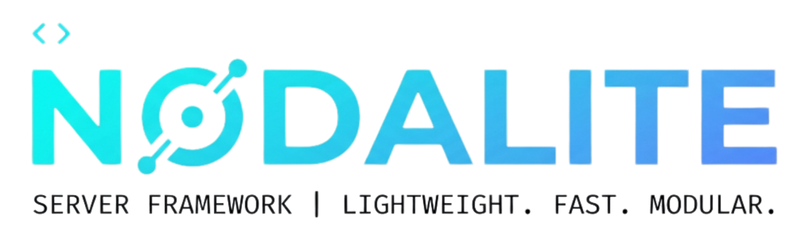

<p align="center">
  <picture>
    <source media="(prefers-color-scheme: dark)" srcset="assets/dark.png">
    <source media="(prefers-color-scheme: light)" srcset="assets/light.png">
    
  </picture>
</p>

<h1 align="center">Nodalite</h1>

<p align="center">
  <strong>Runtime-agnostic TypeScript API framework</strong><br/>
  <em>The same <code>App</code> runs unmodified on Node, Lambda, Cloudflare Workers, Bun, and Deno.</em>
</p>

<p align="center">
  <a href="https://www.npmjs.com/package/nodalite"></a>
  <a href="https://www.npmjs.com/package/nodalite"></a>
  <a href="LICENSE"></a>
  <a href="https://www.typescriptlang.org/"></a>
  <a href="https://github.com/AkkilMG/Nodalite/blob/main/package.json">=18" /></a>
  <a href="https://github.com/AkkilMG/Nodalite"></a>
</p>

---

## Table of Contents

- [Why Nodalite?](#why-nodalite)
- [Features](#features)
- [Requirements](#requirements)
- [Installation](#installation)
- [Scaffolding](#scaffolding)
- [Packages](#packages)
- [Quick Start](#quick-start)
- [Examples](#examples)
- [Development](#development)
- [Contributing](#contributing)
- [Security](#security)
- [License](#license)

---

## Why Nodalite?

Most Node.js frameworks assume a single runtime. Nodalite doesn't.

- **Write once, deploy anywhere** — the same `App` instance runs unmodified on Node.js, Bun, Deno, Cloudflare Workers, and AWS Lambda. No conditional imports, no adapter swapping at the application level.
- **Zero-dependency core** — `@nodalite/core` has literally zero runtime dependencies. It only uses what the JS runtime already provides (Fetch API). Smaller attack surface, faster installs, no supply-chain surprises.
- **Security by default** — built-in middleware for CORS, security headers, rate limiting, JWT auth, and body size limits. Follows OWASP guidance ("reject, don't sanitize") with structured error responses.
- **Serverless-aware** — cold start hooks, disk-cached ML models, body size limits that check `Content-Length` before buffering, and adapters that properly convert API Gateway event shapes.

> Read **[`docs/`](https://github.com/AkkilMG/Nodalite/tree/main/docs)** for the full architecture rationale, API reference, security checklist, and deployment guide.

---

## Features

- **Runtime-agnostic** — same `App` runs unmodified on Node, Bun, Deno, Cloudflare Workers, and AWS Lambda
- **Zero-dependency core** — `@nodalite/core` has zero runtime dependencies
- **Security middleware** — CORS, security headers, rate limiting, JWT auth
- **Background workers** — `worker_threads` for bots, pollers, and CPU offload
- **Scheduler** — cron/interval scheduling for long-running servers; serverless adapter too
- **ML inference** — serverless-aware model runner with local file support, ONNX Runtime adapter, and built-in security (size limits, path protection, format validation)
- **CLI scaffolding** — interactive project generation via `npx create-nodalite`
- **Request validation** — Standard Schema support (Zod, Valibot, ArkType) with structured 400 responses

---

## Requirements

| Requirement | Details |
|---|---|
| **Node.js >= 18** | Required for built-in Fetch API, `worker_threads`, and `crypto.subtle` |
| **Cloudflare Workers / Bun / Deno** | Use `@nodalite/adapter-edge` or no adapter at all |
| **`onnxruntime-node`** | Optional peer dependency — only needed for ONNX ML inference |

---

## Installation

**Core package:**

```bash
npm install nodalite
# or the scoped form:
npm install @nodalite/core
```

**Adapters & extras** — install only what you need:

```bash
npm install @nodalite/adapter-node      # Node.js server
npm install @nodalite/adapter-lambda    # AWS Lambda
npm install @nodalite/adapter-edge      # Cloudflare Workers
npm install @nodalite/middleware         # Security & HTTP middleware
npm install @nodalite/workers            # Background threads
npm install @nodalite/scheduler          # Cron/interval scheduling
npm install @nodalite/ml                 # ML inference
npm install @nodalite/openapi            # OpenAPI spec generation + Swagger UI
```

---

## Scaffolding

Scaffold a new project in seconds:

```bash
npm create nodalite
# or
npx nodalite create
```

Follow the interactive prompts to select a **purpose** (API, Telegram bot,
Lambda, Edge), and optionally add **ML inference**, **security middleware**,
and a **job scheduler**. A ready-to-run project is generated with all
dependencies installed.

---

## Packages

| Package | Description |
|:---|:---|
| `nodalite` | Unscoped alias — re-exports everything from `@nodalite/core` |
| `@nodalite/core` | Router, `Context`, `App`, middleware, errors, validation. **Zero dependencies.** |
| `@nodalite/middleware` | `cors`, `securityHeaders`, `rateLimit`, `jwtAuth`, `logger`, `bodyLimit` |
| `@nodalite/adapter-node` | `serve(app)` — run on a plain Node http/https server |
| `@nodalite/adapter-lambda` | `createLambdaHandler(app)` — API Gateway v1/v2 + Lambda Function URLs |
| `@nodalite/adapter-edge` | `createEdgeHandler(app)` — Cloudflare Workers (Bun/Deno need no adapter) |
| `@nodalite/workers` | `runDetached()` — independent background thread; `WorkerPool` — CPU offload |
| `@nodalite/scheduler` | `Scheduler` — cron/interval for long-running servers; `toServerlessTask()` |
| `@nodalite/ml` | `Model` — cached, engine-agnostic inference runner with built-in model security |
| `@nodalite/openapi` | OpenAPI 3.1.0 spec generation, Swagger UI, and ReDoc endpoints |

---

## Quick Start

### Node.js

```ts
import { App } from '@nodalite/core';
import { cors, securityHeaders } from '@nodalite/middleware';
import { serve } from '@nodalite/adapter-node';

const app = new App();
app.use('*', securityHeaders());
app.use('*', cors({ origin: 'https://your-frontend.example' }));

app.get('/health', (c) => c.json({ ok: true }));
app.get('/users/:id', (c) => c.json({ id: c.req.param('id') }));

serve(app, { port: 3000 });
```

### AWS Lambda

```ts
import { createLambdaHandler } from '@nodalite/adapter-lambda';
export const handler = createLambdaHandler(app);
```

### Cloudflare Workers

```ts
import { createEdgeHandler } from '@nodalite/adapter-edge';
export default createEdgeHandler(app);
```

### Bun / Deno

No adapter needed — `app.fetch` already matches their native server signature:

```ts
export default { fetch: app.fetch };
```

---

## Examples

| Example | Description | Run |
|:---|:---|:---|
| **`examples/basic-api`** | Signup/login with JWT, Zod validation, rate limiting, security headers, route groups, and a CPU-bound endpoint offloaded to a `WorkerPool` | `npm run dev -w examples-basic-api` |
| **`examples/telegram-bot-thread`** | API server + Telegram bot long-polling on an independent `worker_thread` via `runDetached()` | `npm run dev -w examples-telegram-bot-thread` |
| **`examples/lambda-deploy`** | Same `App` deployed as an AWS Lambda function with esbuild bundle + zip script | `npm run build -w examples-lambda-deploy` |
| **`examples/ml-inference`** | ML model inference using `@nodalite/ml` with `onnxEngine()` | See example directory |
| **`examples/security-api`** | Security middleware showcase | See example directory |

---

## Development

```bash
# Install everything across the workspace
npm install

# Build every package (tsup: ESM + CJS + .d.ts)
npm run build --workspaces --if-present

# Run every package's test suite (Vitest)
npm test

# Type-check across every package
npm run typecheck --workspaces --if-present

# Lint
npm run lint
```

Every package is genuinely tested, not just typed: `adapter-node` tests start
a real HTTP server and hit it with `fetch()`; `adapter-lambda` tests use
realistic API Gateway event fixtures; `workers` tests spawn real
`worker_threads` including a crash/restart cycle; `ml` tests spin up a real
local server to verify on-disk model caching.

---

## Contributing

We welcome contributions! Please read our community files before opening issues or PRs:

- [**Contributing Guide**](./CONTRIBUTING.md) — development workflow, code style, PR process
- [**Code of Conduct**](./CODE_OF_CONDUCT.md) — Contributor Covenant v2.1
- [**Changelog**](./CHANGELOG.md) — version history and release notes

```bash
git clone https://github.com/AkkilMG/Nodalite.git
cd nodalite
npm install
npm test
```

---

## Security

If you discover a security vulnerability, please report it privately by emailing **me@akkil.dev**. Do **not** open a public GitHub issue. See [SECURITY.md](./SECURITY.md) for details.

---

## License

[MIT](LICENSE) &copy; 2024-present [Akkil](https://akkil.dev)
